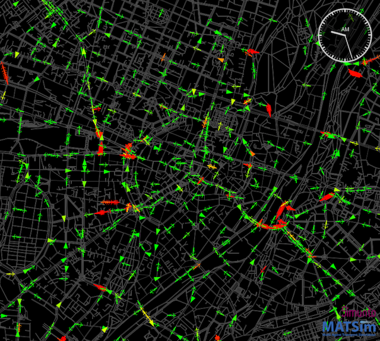

# MATSim Course at TUM

The semester project at TUM investigates if better cycling conditions can attract travellers from car. This repository contains Java classes to prepare and run two MATSim simulations:
* the `base` scenario simulates the status quo
* the `measure` scenario includes enhancements of the cycling infrastructure

The project starts by creating a Munich network with car and bicycle network modes. Then, a synthetic population is used to generate the 5 pct. plans of Munich residents.

### Network modifications 

In principle, two major network modifications take place:
* Increasing the speed limit of bicycles on links that allow bicycles
* Decreasing the speed limit of cars on all links

As a result, the speed limit is set at 30 km/h for all modes. Because public transport and walking are simulated as teleportation modes, the proposed changes do not affect them.

### Visualisation

### Emissions

The project uses the `emissions` contrib and a simplified mapping for cars on urban roads and motorways. Emissions from cars are estimated in the `base` and `measure` scenarios and compared.

### Results

The simulation results did not show any notable change in the modal split in favour of bicycle traffic. The total emissions remained largely unchanged.

### Files

The repository does not include any data that can be used to produce the results.

### Structure

A recommended directory structure is as follows:
* `src` for sources
* `original-input-data` for original input data (typically not in MATSim format)
* `scenarios` for MATSim scenarios, i.e. MATSim input and output data.  A good way is the following:
  * One subdirectory for each scenario, e.g. `scenarios/mySpecialScenario01`.
  * This minimally contains a config file, a network file, and a population file.
  * Output goes one level down, e.g. `scenarios/mySpecialScenario01/output-from-a-good-run/...`.
  
### Import into IntelliJ

`File -> New -> Project from Version Control` paste the repository url and hit 'clone'. IntelliJ usually figures out
that the project is a maven project. If not: `Right click on pom.xml -> import as maven project`.

### Licenses
(The following paragraphs need to be adjusted according to the specifications of your project.)

The **MATSim program code** in this repository is distributed under the terms of the [GNU General Public License as published by the Free Software Foundation (version 2)](https://www.gnu.org/licenses/old-licenses/gpl-2.0.en.html). The MATSim program code are files that reside in the `src` directory hierarchy and typically end with `*.java`.

The **MATSim input files, output files, analysis data and visualizations** are licensed under a <a rel="license" href="http://creativecommons.org/licenses/by/4.0/">Creative Commons Attribution 4.0 International License</a>.
  MATSim input files are those that are used as input to run MATSim. They often, but not always, have a header pointing to matsim.org. They typically reside in the `scenarios` directory hierarchy. MATSim output files, analysis data, and visualizations are files generated by MATSim runs, or by postprocessing.  They typically reside in a directory hierarchy starting with `output`.

**Other data files**, in particular in `original-input-data`, have their own individual licenses that need to be individually clarified with the copyright holders.
